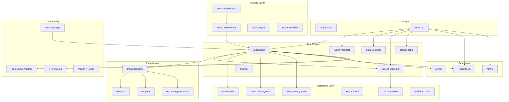
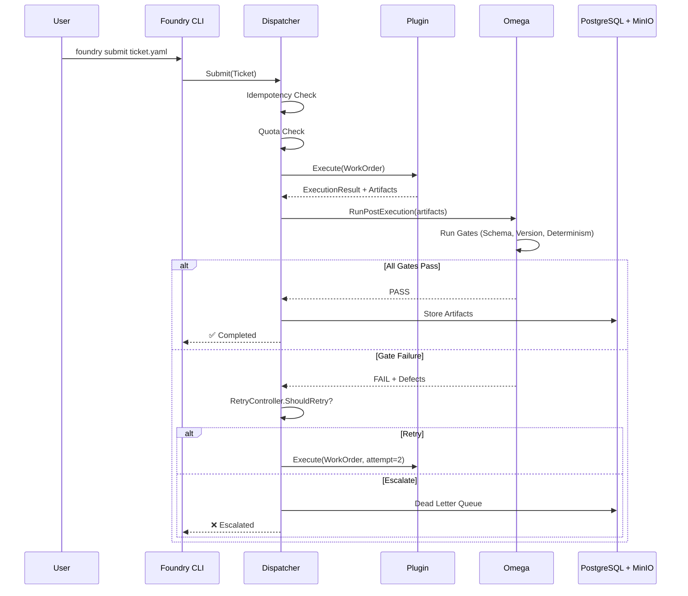

# Partir Core — Architecture

## System Overview



## Data Flow



## Package Structure

```
partir-core/
├── cmd/
│   ├── foundry/          # Foundry CLI (dispatch, status, plugins)
│   └── partir/           # Partir CLI (alpha, beta, omega, round-table)
├── internal/
│   ├── alerting/         # Webhook alert manager
│   ├── alpha/            # Alpha Architect workspace
│   ├── beta/             # Beta Designer workspace
│   ├── config/           # Centralized configuration
│   ├── dispatch/         # Priority queue + tenant quotas
│   ├── factory/          # Factory registration + topology
│   ├── foundry/          # Dispatcher + execution engine
│   ├── omega/            # Quality gates + retry controller
│   ├── resilience/       # Circuit breaker, backoff, DLQ, idempotency
│   ├── security/
│   │   ├── auth/         # JWT authenticator
│   │   ├── audit/        # Audit logging + compliance export
│   │   ├── middleware/   # Auth + RBAC middleware
│   │   └── secrets/      # SecretProvider interface
│   ├── storage/          # PostgreSQL + MinIO abstraction
│   └── sync/             # External sync (Jira, Linear)
├── pkg/
│   ├── metrics/          # Prometheus metrics + health server
│   ├── plugin/           # Plugin SDK (interface, manifest, registry)
│   └── telemetry/        # OpenTelemetry tracing
├── migrations/           # Database migrations (001-013)
└── deploy/               # Docker + Helm charts
```
